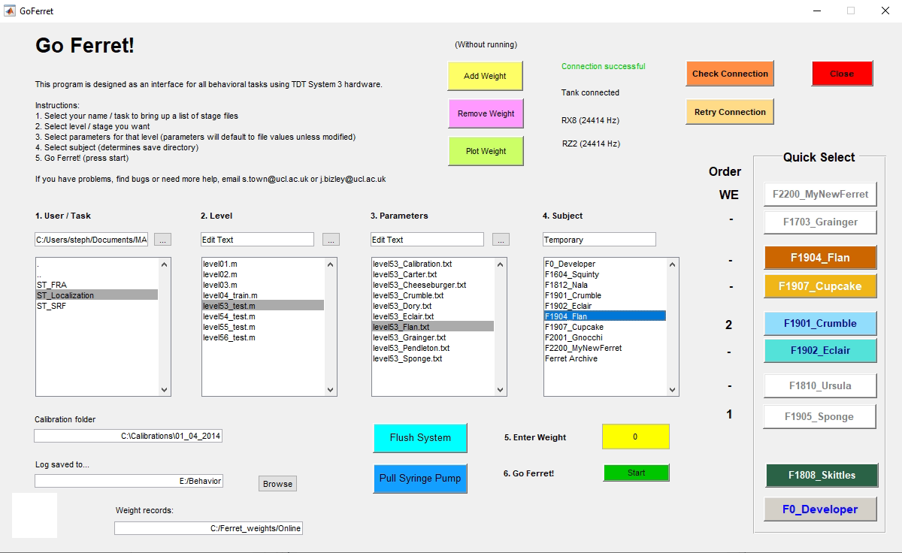

# GoFerret

Matlab framework for behavioral testing.

## Requirements
- Matlab (tested on every version since R2011)
- OpenEx Developer Tools ([Tucker Davis Technologies](https://www.tdt.com/support/downloads/))
- Python (optional, for video recording with Realsense cameras)

<br>


## Get Started

Download the repository and update paths / settings in config.json (see [Set Configuration](docs/set_config.md) for more details)

Open repository as the current folder in in Matlab, or add to Matlab path, and run the following in the command line:


```sh
GoFerret
```




## Further Information

See [Documentation](./docs) for further information on configuration, task information and [frequently asked questions](./docs/faq.md)
